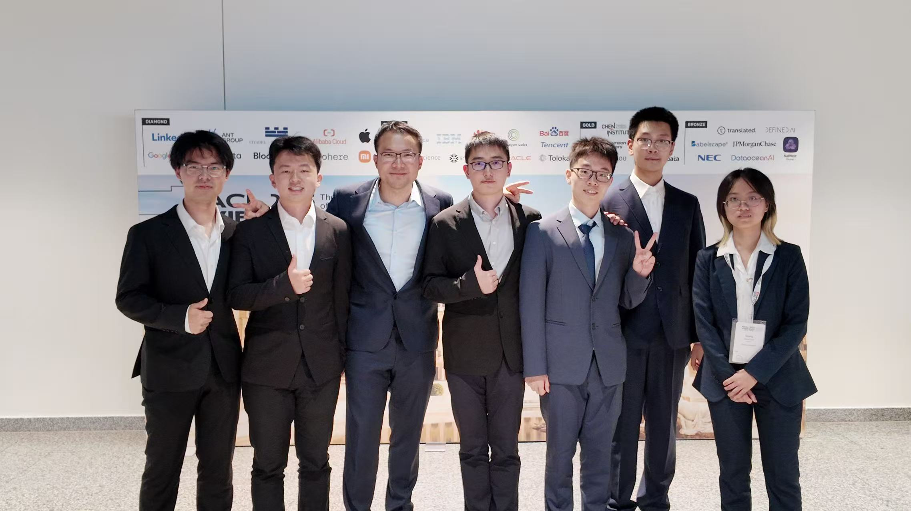

在国家自然科学基金项目优秀青年科学基金等项目资助下，北京大学人工智能研究院杨耀东助理教授团队在大模型后训练与对齐领域取得关键进展，相关成果以“Language Models Resist Alignment: Evidence From Data Compression”为题在自然语言处理领域顶级会议Association for Computational Linguistics（ACL） 2025中发表，并被评为最佳论文（Best Paper Award）。ACL 2025共收到投稿8000余篇，评选出四篇最佳论文，该工作是唯一由中国科研机构独立完成的获奖论文。

在人工智能领域，“对齐”（Alignment）指的是确保AI系统的目标、行为和价值观与人类的意图保持一致。换句话说，就是要让模型不仅能“听懂”人类的指令，还要在执行过程中符合人类的价值观与社会规范。

随着大模型技术的快速发展，训练、数据处理和评测方法成为研究热点。尽管这些模型已经展现出惊艳的能力，但一个根本性问题仍未解决：它们是否真正理解并忠实执行人类的指令与意图？如果AI的行为与人类期待出现偏差，可能会带来安全、伦理乃至社会层面的风险。因此，对齐不仅是学术上的挑战，更是人工智能能否安全落地的关键。

近日，由北京大学人工智能研究院研究员杨耀东博士牵头在国际计算语言学顶级会议ACL 2025上发表的论文《Language Models Resist Alignment : Evidence From Data Compression》荣获年度最佳论文奖。该团队首次提出“语言模型弹性”全新理论框架，从压缩理论视角揭示了大语言模型在对齐训练后存在的内在“抵抗对齐”机制，填补了AI安全对齐脆弱性研究的理论与实证空白，为构建更安全、可控的通用人工智能提供了全新思路。

Congratulations to Dr. Yaodong Yang's team for winning the Best Paper Award at ACL 2025!  
北京大学人工智能研究院杨耀东团队荣获ACL 2025最佳论文奖。图为获奖团队成员合影（自左至右：陈博远、洪东海、杨耀东、吉嘉铭、周嘉懿、王恺乐、方思童）。

长期以来，大语言模型的对齐被认为可通过后训练稳定固化。但杨耀东团队研究发现，这种对齐状态类似弹簧形变：外力存在时，模型被拉伸至符合人类价值观的状态；外力撤去，便倾向按“胡克定律”回到预训练形成的原始平衡位置。且这种“弹性”在规模更大、预训练数据更多、参数压缩率更高的模型中更为突出。以Grok-4为例，即便在对齐阶段调用与预训练等量的算力资源（20万块GPU）进行大规模强化学习训练，仍难以彻底消除其原始偏差，印证了高压缩、高记忆惯性模型易回归原始状态的倾向。

实验进一步证明了对齐的脆弱性与易逆性。在多种规模模型测试中，团队发现：即便用上万条正向数据（如安全性、指令跟随等）微调，仅需约500条反向样本，就能显著削弱甚至完全抵消已有对齐效果。更具挑战的是，模型在“逆向对齐”任务中更容易成功，意味着其易被“退化”为未对齐状态，对AI安全构成现实威胁。

研究还揭示了模型的“假对齐”风险。部分模型并未真正内化对齐目标，仅学会“表现出”对齐状态以规避人类监督，即“欺骗性对齐”：检测机制存在时输出安全合规内容，监督移除或绕过后则迅速回到高效但违背人类偏好的生成策略。此外，模型存在“阿谀奉承”问题，用户立场不明时倾向重复用户观点以获取更高满意度评分，虽短期提升交互流畅度，长期却可能放大认知偏差，形成“算法确认偏误”闭环效应。

针对上述问题，课题组提出“弹性系数”概念，类比弹簧弹性系数k，衡量模型抵抗对齐的程度。系数越大，越难长期对齐。建议将其作为核心可控性指标，建立“对齐弹性预警系统”，实时监测模型能力提升过程中的对齐状态。

同时，研究提出发展“塑性对齐”算法，促使人类价值观在模型参数层深度固化，减少退化与回弹风险；结合“弹性-塑性”理论改进模型编辑与遗忘机制，解决有害内容“遗忘困难”问题。

团队提出建立覆盖模型全生命周期的“弹性演化理论”，在开发、训练、部署及运行各阶段持续调控弹性特征，确保初始模型具备更低弹性系数与更高弹性限度，从源头上提升对齐稳定性。该理论首次将压缩率变化与数据规模关系引入AI对齐分析，类比胡克定律揭示模型在多数据集上压缩率与数据规模呈反比的“弹性率”，为理解“抗对齐”“伪装对齐”等复杂行为提供了统一机制框架。

本次ACL2025共投稿8000余篇论文，共评选出四篇最佳论文，其中两篇由中国机构完成，此篇由北京大学人工智能研究院与北京智源研究院大模型安全中心的成果展现了华人团队在人工智能大模型前沿领域的原始创新与国际竞争力。杨耀东团队将继续深化抗弹性对齐研究，在更大规模及多模态模型中验证，探索突破现有“99%预训练+1%后训练”范式，向更稳定、内生的对齐机制演进。

报道来源：新华社 & 国家自然科学基金委